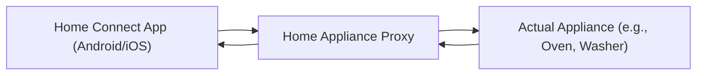

# Home Connect - Home Appliance Proxy

A cross-platform JavaFX-based application that acts as a proxy for Home Connect smart home appliances.

## Overview

This tool enables deep inspection and debugging of the communication between the official Home Connect app and smart home appliances.
It works by impersonating a Home Connect appliance and relaying traffic between the real device and the Home Connect app.

## Features

- 🔍 **Discovery via mDNS**: Automatically searches for Home Connect devices on the local network using multicast DNS (mDNS).
- 🎭 **Device Emulation**: Can impersonate a Home Connect home appliance, mimicking its identity on the network.
- 🔄 **Message Interception**: Acts as a man-in-the-middle, intercepting messages between the Home Connect app and the actual appliance.
- 🔓 **Message Decryption**: Intercepted messages are decrypted and displayed to the user for analysis.
- 🔁 **Transparent Forwarding**: While messages are inspected, they are also forwarded to the actual device, ensuring seamless operation for the Home Connect app.

## Platform Compatibility

- ✅ Windows
- ✅ macOS
- ✅ Linux

## Use Cases

- Reverse engineering of the Home Connect protocol
- Debugging custom smart home integrations
- Security research and analysis
- Learning how IoT appliances communicate on local networks

## Requirements

- Java 21 or higher
- Gradle build tool
- Operating System: Windows, Linux, or macOS

## How It Works

Follow these steps to run the Home Connect Appliance Proxy:

1. **Start the application**  
   Launch the app using either of the following methods:
    - `./gradlew run`
    - or
    - `java -jar ./build/libs/home-connect-appliance-proxy-linux-x.y.z.jar`

2. **Wait for your appliance to appear**  
   The application will search the local network for Home Connect appliances via mDNS.

3. **Configure the secrets**  
   If you don't already have the cryptographic profile of your appliance (required to decrypt messages), you can use the following project to obtain it:  
   👉 [homeconnect-profile-downloader](https://github.com/bruestel/homeconnect-profile-downloader)

4. **Start the proxy**  
   Once the secrets are in place and the appliance has been detected, start the proxy.

5. **Restart the official Home Connect app**  
   Fully close the Home Connect app on your Android or iOS device — make sure it is force-closed (swiped away). Then reopen it.

6. **Observe the connection**  
   The official app should now connect to the proxy instead of the real appliance.  
   If it doesn't work on the first try, repeat step 5 a couple of times.

Once connected, the proxy will display and forward decrypted communication between the Home Connect app and your actual appliance.

## Build and Run

1. Clone the repository
2. Build the project using Gradle: `./gradlew build`
3. Start the application: `java -jar ./build/libs/home-connect-appliance-proxy-linux-x.y.z-SNAPSHOT.jar`

## Disclaimer

This tool is intended for **educational and research purposes only**. Do not use it to interfere with or disrupt devices or services that you do not own or have explicit permission to analyze. Misuse may violate the terms of service of the Home Connect platform or applicable laws.

## License

This project is licensed under the Apache License 2.0.  
See the [LICENSE](https://www.apache.org/licenses/LICENSE-2.0) file or visit [apache.org/licenses/LICENSE-2.0](https://www.apache.org/licenses/LICENSE-2.0) for details.

